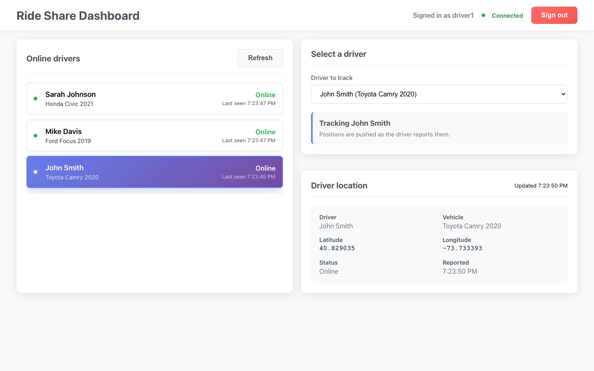
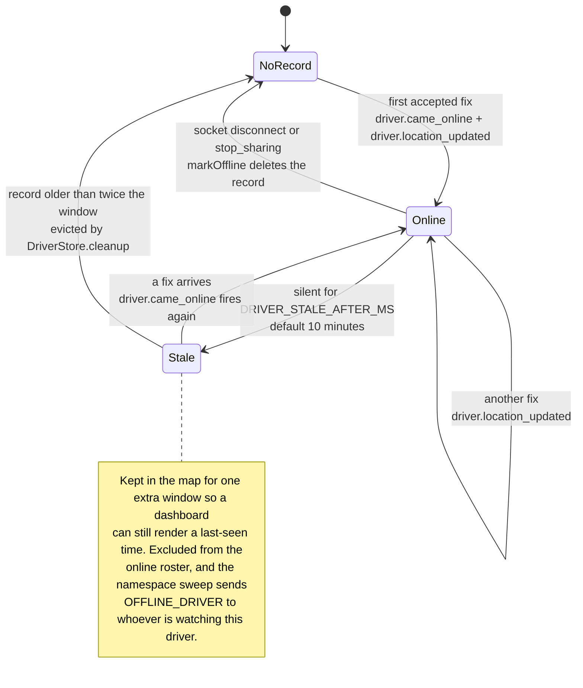
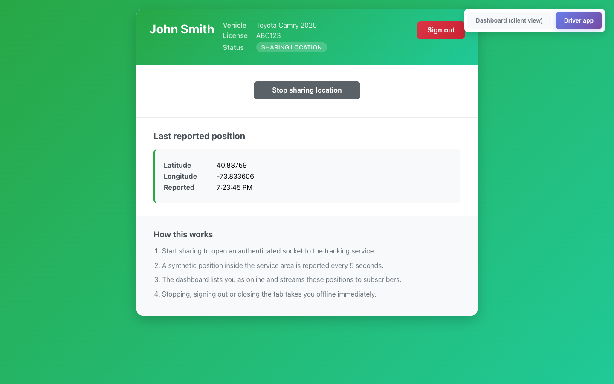
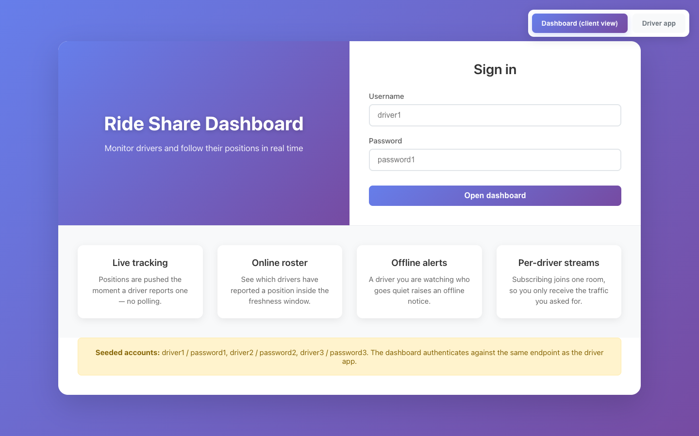

# Ride-share driver tracking

An Express + Socket.IO service that accepts position reports from authenticated
drivers and streams each one to exactly the dashboard clients watching that
driver. A small React client ships alongside it with two surfaces: the
monitoring dashboard, and a driver simulator standing in for a phone.

> **On the name.** The package is called `ride-share-backend`, which oversells it
> in two directions. There are no rides — no trip, no matching, no fare and no
> passenger anywhere in the code, only driver presence and live coordinates. And
> it is not backend-only: `frontend/` is part of the submission. Read the repo as
> *driver location tracking*, which is what it actually does.

This is an interview take-home, so it stays scoped to one exercise: token auth, a
REST **and** a WebSocket path for position reports, a dashboard that subscribes
to a single driver, and an offline notice when that driver goes quiet. Nothing
has been invented on top of it.



## Running it

Node 20 or newer (developed and tested on 22).

```bash
npm install
npm run dev                 # API + both socket namespaces on :3001

cd frontend                 # second terminal
npm install
npm start                   # React dev server on :3000
```

Open <http://localhost:3000>, switch to **Driver app**, sign in as
`driver1` / `password1` and press **Start sharing location**. In a second tab
stay on **Dashboard**, sign in with the same credentials and pick John Smith
from the roster to watch his positions arrive.

The seeded directory is `driver1`/`password1`, `driver2`/`password2`,
`driver3`/`password3`. There is no separate operator account — the dashboard
signs in against the same `POST /api/login` as the driver app.

## What "online" means here

Presence is derived, not declared. A driver is online while their most recent
fix is newer than `DRIVER_STALE_AFTER_MS`, and every transition below is
published on an in-process event bus (`src/realtime/events.js`) that the socket
layer subscribes to. The service that writes positions never imports Socket.IO.



Two consequences worth knowing before reading the code:

- **`Stale → Online` re-announces.** `recordLocation()` reads `isDriverOnline()`
  *before* it writes, so a driver who lapsed past the window and then reports
  again emits `driver.came_online` a second time. Dashboards treat that as a
  roster change, which is what you want.
- **Disconnecting deletes, going stale does not.** A socket close or
  `stop_sharing` runs `markOffline()`, which drops the location and socket rows
  immediately. Lapsing merely ages out of the roster, and the record survives one
  further window so `lastSeen` still has something to report.

A driver's *socket* is tracked separately from their presence. The namespace
records the socket id on connect and a disconnect handler only takes the driver
offline if the id still matches, so a stale connection closing cannot evict a
driver who has already reconnected.

## Fan-out is per driver, not per namespace

Location updates are the only high-frequency event in this system, so they are
the only thing worth being careful about. Subscribing is a room join:

```
socket.join("driver:" + driverId)     // /dashboard
namespace.to("driver:" + id).emit("driver_data", …)
```

A position therefore costs one write per client actually watching that driver,
rather than one per connected client. Namespace-wide broadcasts are reserved for
roster transitions — `online_drivers`, `driver_connected`,
`driver_disconnected` — whose rate is bounded by how often drivers come and go,
not by report frequency. Positions are pushed as they arrive rather than polled,
so there is no per-client timer at all: the namespace runs exactly one
`setInterval`, the offline sweep, and it is `unref`'d.

These are complexity counts read off the code, not a benchmark. No load test was
run, and nothing here is labelled as measured.

## Logout has to be enforced

A JWT stays cryptographically valid until it expires, so `POST /api/logout`
means nothing unless revocation is recorded server-side and consulted on every
request. `DriverStore` keeps an `activeTokens` map, and `authoriseToken()` checks
it after verifying the signature — on HTTP requests and on the socket handshake
alike. Token lifetime has one source of truth, `JWT_EXPIRY_SECONDS`, which feeds
both the JWT `exp` claim and the expiry stamped on the revocation record.

Credentials are compared with `crypto.timingSafeEqual`, and the driver directory
is built on `Object.create(null)` so a username like `constructor` cannot
resolve to an inherited member.

## What the tests hold in place

`npm test` runs 90 tests across 8 files on the built-in `node:test` runner — no
Jest, no extra config. The realtime suite starts a real HTTP + Socket.IO server
on port 8511 and drives it with a real `socket.io-client`; nothing about the
transport is mocked. Named cases worth pointing at:

| Test | What it pins |
| --- | --- |
| `the driver namespace rejects a token that was revoked by logout` | revocation is checked on the handshake, not just on HTTP |
| `a dashboard subscribed to another driver is not sent that traffic` | room scoping is actually in effect |
| `a reconnecting driver is not taken offline by their stale socket` | the socket-id guard on disconnect |
| `a driver who went stale is announced as online again on their next fix` | the `Stale → Online` edge above |
| `POST /api/login does not leak which half of the pair was wrong` | one error shape for bad user and bad password |

The freshness-window tests advance an injected clock rather than sleeping —
`DriverStore` takes a `now()` in its constructor for exactly that reason.

A verbatim `curl` transcript against a running server, including the
logout-replay check, is in [`docs/api-transcript.md`](docs/api-transcript.md);
the captured run is in [`docs/test-output.md`](docs/test-output.md).

```bash
npm test          # 90 tests
npm run lint      # ESLint 9 flat config, backend and frontend
npm run format    # Prettier
```

`Dockerfile` and `docker-compose.yml` are authored — multi-stage, non-root, with
a `/health` healthcheck and a `--target test` stage that runs the suite inside
the image — but **the image has not been built or booted**. The daemon was
unavailable, so treat both as unverified.

## HTTP surface

| Method | Path | Auth | Purpose |
| --- | --- | --- | --- |
| `GET` | `/health` | — | Liveness probe. |
| `GET` | `/` | — | Machine-readable index of the API. |
| `POST` | `/api/login` | — | Exchange credentials for an access token. |
| `POST` | `/api/logout` | bearer | Revoke the presented token and go offline. |
| `GET` | `/api/profile` | bearer | Token claims plus the caller's last fix. |
| `POST` | `/api/driver/update` | bearer | Report a position. |
| `GET` | `/api/driver/location` | bearer | The caller's own last fix. |
| `GET` | `/api/driver/online` | — | Drivers with a fix inside the freshness window. |
| `GET` | `/api/driver/:driverId/location` | — | One driver's last fix. |
| `GET` | `/api/driver/stats` | — | Store occupancy counters. |

## Socket surface

**`/driver/update`** — authenticated, token in `handshake.auth.token`.

| Direction | Event | Payload |
| --- | --- | --- |
| → server | `location_update` | `{ lat, lng }` |
| → server | `start_sharing` / `stop_sharing` / `ping` | — |
| ← client | `connected` | `{ driverId, name, timestamp }` |
| ← client | `location_updated` | `{ success, location, withinServiceArea, timestamp }` |
| ← client | `error` | `{ code, message }` |

**`/dashboard`** — unauthenticated read-only view.

| Direction | Event | Payload |
| --- | --- | --- |
| → server | `subscribe` | `{ driverId }` — joins room `driver:<id>` |
| → server | `unsubscribe` / `get_online_drivers` / `ping` | — |
| → server | `get_driver_info` | `{ driverId }` |
| ← client | `online_drivers` | `{ drivers, count, timestamp }` |
| ← client | `driver_data` | one position — **only to that driver's room** |
| ← client | `driver_connected` / `driver_disconnected` | roster transitions, namespace-wide |
| ← client | `driver_offline` / `OFFLINE_DRIVER` | a subscribed driver is not reporting |

## Environment

Copy `.env.example` to `.env`. Everything has a working default except
`JWT_SECRET` under `NODE_ENV=production`, where startup throws rather than fall
back to the development key.

| Variable | Default | Purpose |
| --- | --- | --- |
| `PORT` | `3001` | HTTP port, shared by the API and both namespaces. |
| `NODE_ENV` | `development` | `production` enables the secret check and hides error detail. |
| `JWT_SECRET` | dev-only fallback | HMAC key. **Required** in production. |
| `JWT_EXPIRY_SECONDS` | `300` | Token lifetime — the `exp` claim and the revocation record. |
| `CORS_ORIGINS` | `http://localhost:3000` | Comma-separated allowed browser origins. |
| `DRIVER_STALE_AFTER_MS` | `600000` | The freshness window in the diagram above. |
| `OFFLINE_SWEEP_INTERVAL_MS` | `60000` | How often subscribed-but-silent drivers are re-checked. |
| `STORE_CLEANUP_INTERVAL_MS` | `60000` | How often expired tokens and dead rows are evicted. |
| `JSON_BODY_LIMIT` | `16kb` | Request body cap. |
| `LOG_LEVEL` | `info`, `silent` under test | `silent` \| `error` \| `warn` \| `info` \| `debug` |

The React client reads one variable, `REACT_APP_API_URL` (default
`http://localhost:3001`).

## The other two screens

Captured with Playwright at 1440×900 against a running backend and dev server,
with three seeded drivers reporting live positions — every coordinate and
timestamp on screen is from that session.

**Driver simulator** — reports a synthetic position inside the service area
every 5 seconds over its authenticated socket.



**Sign-in** — the same form for both surfaces.



## Where things live

```
src/
  server.js                  Composition root: HTTP server + Socket.IO + listen
  app.js                     Express app factory (no listen, no Socket.IO)
  config/config.js           Env parsing, defaults, production fail-fast
  routes/                    URL -> controller wiring only
  controllers/               Request/response translation only
  services/
    locationService.js       Validate, persist and publish a position
    driverService.js         Read-side queries (roster, snapshot, stats)
  realtime/
    index.js                 Attaches Socket.IO and both namespaces
    events.js                Domain event bus + event-name constants
    driverNamespace.js       /driver/update  (authenticated)
    dashboardNamespace.js    /dashboard      (rooms, roster, offline sweep)
  models/driverStore.js      DriverStore class + the shared instance
  utils/                     auth, credentials, locationGenerator, logger
tests/                       node:test, one file per module + two integration
frontend/src/                App shell, api/config.js, Dashboard / DriverApp / LoginPage
docs/                        Transcript, captured test run, screenshots
```

`app.js` exports a factory with no `listen()` so supertest can drive the HTTP
surface without opening a port, and `server.js` is the only module that
constructs a Socket.IO server. `DriverStore` is the only module that knows how
state is stored — swapping the three `Map`s for Redis means reimplementing that
interface and touching nothing else.

## Out of scope

- **State lives in process memory.** A restart loses every position and every
  issued token, and the service cannot scale past one replica — a second
  instance would have its own roster and its own rooms. Redis plus the Socket.IO
  Redis adapter is the fix; it is not done here.
- **Credentials are plain text in `src/utils/credentials.js`**, deliberately, so
  the app runs with no seed step. That is not an auth system: production needs a
  user table, password hashing and a rate limit on `/api/login`, none of which
  exist.
- **The `/dashboard` namespace is unauthenticated.** Anyone who can reach the
  port can watch any driver. The sign-in screen gates the React view, not the
  socket.
- **No refresh tokens.** A 300-second access token simply expires and the client
  must sign in again; the driver simulator does not handle that mid-session.
- **There is no map.** Positions are rendered as coordinates. A tile provider
  would have meant an API key and a bill for an exercise about the transport.
- **Positions are synthetic** — uniform random points inside a New York bounding
  box, not a plausible trajectory. `generateNearbyLocation()` exists for a random
  walk but the simulator does not use it.
- **No history.** Only the latest fix per driver is kept: no trail, no replay, no
  analytics.
- **No frontend tests.** The suite is backend-only. The React client was driven
  with Playwright to capture the screenshots above, which is evidence but not a
  regression suite.
