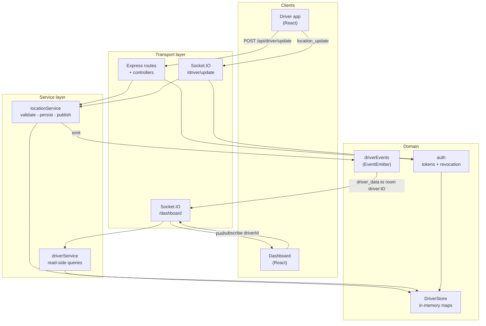
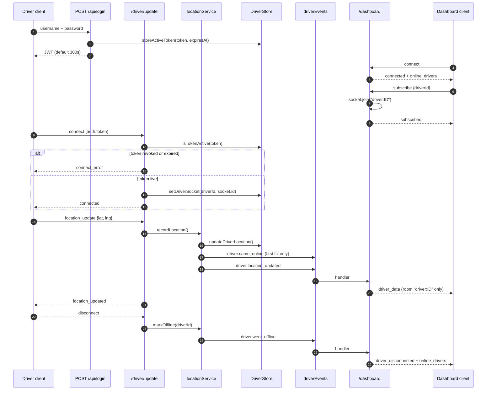

# Ride-Share Driver Tracking

A real-time driver-location service: an Express + Socket.IO backend that accepts
position reports from authenticated drivers and streams them to dashboard
clients, plus a small React client with two surfaces — a monitoring dashboard
and a driver simulator that stands in for a phone.

This repository is a **take-home submission for MightyByte** ("MightyByte rtc
backend challenge", per the original commit). The brief is not included in the
repository; from the code the exercise was to build a driver-tracking backend
with token authentication, a REST *and* a WebSocket path for location updates, a
dashboard that can subscribe to one driver at a time, and an offline
notification when a subscribed driver stops reporting. Everything below is
scoped to that; no product features have been invented on top of it.

## Screenshots

Captured with Playwright at 1440×900 against a locally running backend and
React dev server, with three seeded drivers reporting live positions.

**Dashboard — tracking a driver in real time**


**Driver simulator — reporting positions over the WebSocket**


**Sign-in**


A verbatim request/response transcript against a running server, including the
logout-revocation check, is in [`docs/api-transcript.md`](docs/api-transcript.md).
The full test run is in [`docs/test-output.md`](docs/test-output.md).

## Architecture

Layered, with dependencies pointing inward. The HTTP controllers and the socket
namespaces are both thin transports over one service layer; neither knows about
the other, and neither touches the store directly. They communicate through a
domain event bus, which is what lets a REST `POST` reach a WebSocket subscriber
without the two layers importing each other.



## Request flow

A driver reporting a position, and that position reaching exactly the dashboard
clients subscribed to that driver.



## Quickstart

Requires Node 20 or newer.

```bash
# Backend (http://localhost:3001)
npm install
npm run dev

# Frontend, in a second terminal (http://localhost:3000)
cd frontend
npm install
npm start
```

Open http://localhost:3000, pick **Driver app**, sign in as `driver1` /
`password1` and press **Start sharing location**. Then open a second tab, stay
on **Dashboard**, sign in with the same credentials and select John Smith from
the list to watch positions arrive.

Seeded accounts (see [Limitations](#limitations)): `driver1`/`password1`,
`driver2`/`password2`, `driver3`/`password3`. The dashboard has no separate
operator directory — it authenticates against the same `POST /api/login`.

## Configuration

Copy `.env.example` to `.env`. Every variable has a working default except
`JWT_SECRET` in production, where the server refuses to start without one.

| Variable | Required | Default | Purpose |
| --- | --- | --- | --- |
| `PORT` | no | `3001` | HTTP port for the API and both Socket.IO namespaces. |
| `NODE_ENV` | no | `development` | `development`, `production` or `test`. `production` enables fail-fast secret checking and hides error details. |
| `JWT_SECRET` | **in production** | dev-only fallback | HMAC key for access tokens. Startup throws if unset while `NODE_ENV=production`. |
| `JWT_EXPIRY_SECONDS` | no | `300` | Access-token lifetime. Drives both the JWT `exp` claim and the server-side revocation record. |
| `CORS_ORIGINS` | no | `http://localhost:3000` | Comma-separated browser origins allowed to call the API and open sockets. |
| `DRIVER_STALE_AFTER_MS` | no | `600000` | A driver counts as online while their last fix is newer than this. |
| `OFFLINE_SWEEP_INTERVAL_MS` | no | `60000` | How often the dashboard re-checks subscribed-but-silent drivers. |
| `STORE_CLEANUP_INTERVAL_MS` | no | `60000` | How often expired tokens and long-dead driver rows are evicted. |
| `JSON_BODY_LIMIT` | no | `16kb` | Maximum accepted request body. |
| `LOG_LEVEL` | no | `info` (`silent` under test) | `silent`, `error`, `warn`, `info` or `debug`. |

The React client reads one variable, `REACT_APP_API_URL` (default
`http://localhost:3001`), which points it at the backend.

## HTTP API

| Method | Path | Auth | Purpose |
| --- | --- | --- | --- |
| `GET` | `/health` | — | Liveness probe. |
| `GET` | `/` | — | Machine-readable index of the API surface. |
| `POST` | `/api/login` | — | Exchange credentials for an access token. |
| `POST` | `/api/logout` | bearer | Revoke the presented token and go offline. |
| `GET` | `/api/profile` | bearer | Token claims plus the caller's last fix. |
| `POST` | `/api/driver/update` | bearer | Report a position. |
| `GET` | `/api/driver/location` | bearer | The caller's own last fix. |
| `GET` | `/api/driver/online` | — | Drivers with a fix inside the freshness window. |
| `GET` | `/api/driver/:driverId/location` | — | One driver's last fix. |
| `GET` | `/api/driver/stats` | — | Store occupancy counters. |

## WebSocket API

**`/driver/update`** — authenticated with the access token in `handshake.auth.token`.

| Direction | Event | Payload |
| --- | --- | --- |
| → server | `location_update` | `{ lat, lng }` |
| → server | `start_sharing` / `stop_sharing` / `ping` | — |
| ← client | `connected` | `{ driverId, name, timestamp }` |
| ← client | `location_updated` | `{ success, location: { lat, lng, timestamp }, withinServiceArea }` |
| ← client | `error` | `{ code, message }` |

**`/dashboard`** — unauthenticated read-only view.

| Direction | Event | Payload |
| --- | --- | --- |
| → server | `subscribe` | `{ driverId }` — joins room `driver:<id>` |
| → server | `unsubscribe` / `get_online_drivers` / `ping` | — |
| → server | `get_driver_info` | `{ driverId }` |
| ← client | `online_drivers` | `{ drivers, count, timestamp }` |
| ← client | `driver_data` | one driver's position — **only to that driver's room** |
| ← client | `driver_connected` / `driver_disconnected` | roster transitions, namespace-wide |
| ← client | `driver_offline` / `OFFLINE_DRIVER` | subscribed driver is not reporting |

## Development

```bash
npm test          # 90 tests: unit + HTTP (supertest) + live Socket.IO
npm run lint      # ESLint 9 flat config, backend and frontend
npm run format    # Prettier
npm run dev       # nodemon
```

The suite uses the built-in `node:test` runner — no Jest, no extra runner
config. The realtime tests start a real HTTP + Socket.IO server on port 8511 and
drive it with a real `socket.io-client`; nothing about the transport is mocked.

Docker images are authored but **not built in this pass** (the daemon was off):

```bash
docker compose config          # parse-check, verified
docker build --target test .   # runs the suite inside the image
docker compose up --build      # requires JWT_SECRET in .env
```

## Project structure

```
src/
  server.js                    Composition root: HTTP server + Socket.IO + listen
  app.js                       Express app factory (no listen, no Socket.IO)
  config/config.js             Env parsing, defaults, production fail-fast
  routes/                      URL -> controller wiring only
  controllers/                 Request/response translation only
  services/
    locationService.js         Validate, persist and publish a position update
    driverService.js           Read-side queries (roster, snapshot, stats)
  realtime/
    index.js                   Attaches Socket.IO and both namespaces
    events.js                  Domain event bus + event-name constants
    driverNamespace.js         /driver/update  (authenticated)
    dashboardNamespace.js      /dashboard      (rooms, roster, offline sweep)
  models/driverStore.js        DriverStore class + the shared instance
  utils/
    auth.js                    Token signing, verification, revocation checks
    credentials.js             Seeded driver directory
    locationGenerator.js       Service-area maths and the position simulator
    logger.js                  Level-aware logging
tests/                         node:test suites, one per module + two integration
frontend/src/
  App.js                       Mode switch between the two surfaces
  api/config.js                API base URL and the simulator's geometry
  components/                  Dashboard, DriverApp, LoginPage
docs/                          Captured transcript, test output, screenshots
```

## Design notes

**Transports are thin; the service layer owns the rules.** `POST
/api/driver/update` and the `location_update` socket event both do exactly one
thing: hand `{driverId, lat, lng}` to `locationService.recordLocation()` and
translate its result. Before, each transport carried its own copy of the
validation, the profile lookup, the online-transition detection and the
broadcast — about forty duplicated lines that had already begun to drift.

**A domain event bus, not a module cycle.** The REST controller previously did
`const { io } = require('../server')` *inside a request handler* to reach the
Socket.IO instance. That is a circular import papered over by lazy evaluation,
and it made the controller impossible to test without booting a listening
server. The service now emits `driver.location_updated` /
`driver.came_online` / `driver.went_offline` on an `EventEmitter`; the realtime
layer subscribes. The service has no idea Socket.IO exists.

**Fan-out is scoped to rooms.** This is the real bottleneck in a tracking
system: location updates are the high-frequency event, and everything else is
rare. The original dashboard namespace gave *every connected client its own pair
of `setInterval` timers* (a 5-second poll of the store and a 60-second offline
check) and broadcast every driver's every update to every client. With `C`
dashboard clients and `D` drivers reporting at rate `r`, that is `2C` timers and
`C × D × r` socket writes per second, regardless of what anyone was watching.
Now a subscription is `socket.join("driver:<id>")`, updates are emitted to that
room only, and one namespace-wide timer handles the offline sweep: `1` timer and
`r × (subscribers of the reporting driver)` writes. The polling loop is gone
entirely — positions are pushed when they arrive, which is also lower latency.
The remaining namespace-wide broadcasts (`online_drivers`,
`driver_connected`/`driver_disconnected`) fire on roster *transitions*, not on
every position, so their rate is bounded by how often drivers come and go.

**The store is the only module that knows how state is stored.** `DriverStore`
is a class with an injectable clock, exported alongside a shared instance.
Swapping the three `Map`s for Redis means reimplementing that interface and
nothing else. It is also what makes the freshness-window tests deterministic —
they advance a fake clock rather than sleep.

**Extensibility seam.** The one seam worth having here is the event bus.
Anything that needs to react to driver movement — a geofence checker, an audit
log, a Kafka producer, a second dashboard protocol — subscribes to
`driverEvents` without touching the service or the store. `realtime/` is already
just one such subscriber, which is the proof that the seam works.

**Token revocation is enforced, not decorative.** See the next section.

## Bugs fixed in this pass

The repository had never been reviewed. These were real defects, each now
covered by a test:

- **Logout did not log anyone out.** The store kept an `activeTokens` map and an
  `isTokenActive()` method, but the auth middleware never called it — it only
  verified the JWT signature. A token stayed usable for its full lifetime after
  `POST /api/logout`. The middleware now checks the revocation record.
- **`Authorization` parsing accepted the wrong scheme.** `header.split(' ')[1]`
  treated `Basic <jwt>` as valid and yielded `undefined` for a bare `Bearer`.
- **Token lifetime had two sources of truth**: a `'5m'` string for the JWT and a
  hardcoded `setMinutes(+5)` for the revocation record. Both now derive from
  `JWT_EXPIRY_SECONDS`.
- **A reconnecting driver was knocked offline by their own stale socket.** The
  disconnect handler called `removeDriver()` unconditionally, so the old
  connection's close event evicted the new one. It now checks the socket id.
- **Every dashboard client leaked two timers per subscription** and was never
  cleaned up on a resubscribe path; a per-connection `setTimeout` also fired
  after disconnect.
- **The store's cleanup `setInterval` was started at module load and never
  unref'd**, so importing the store kept a Node process alive forever. It is now
  started by the composition root and unref'd.
- **Express middleware was ordered error-handler-before-404**, which left the
  fallback unreachable for anything that called `next(err)`.
- **The React dashboard never cleared a disconnected driver.** The
  `driver_disconnected` handler closed over `selectedDriverId` from the first
  render, so the comparison was always against `''`.
- **The driver app always showed "Invalid Date"** — it rendered
  `currentLocation.timestamp` from a payload that did not carry one.
- **"Stop sharing" logged the driver out.** It called `POST /api/logout`, which
  revoked the access token, so sharing could not be restarted without signing in
  again. Disconnecting the socket is what takes a driver offline.
- **Every position was written twice**, once over the socket and once over REST.
  The client now uses the socket while it is connected and falls back to REST.
- **`.driver-info` was defined in two stylesheets** with conflicting `display`
  values; CRA bundles them into one global sheet, so the driver header rendered
  on top of itself.
- **`express.json({ limit: '10mb' })`** for a two-float payload; now `16kb`.
- **Dead code**: `getLocation` was exported but never routed (now
  `GET /api/driver/location`), and `isWithinNYCBounds` was never called (now
  surfaced as `withinServiceArea` on every update).
- **`node_modules`, `.env` and `.DS_Store` were not git-ignored**, and two
  `.DS_Store` files were committed.

The README itself over-promised in one place: it told the reader to "use any
username/password combination to access the dashboard", and the sign-in form
said the same. The server has never accepted that — the dashboard posts to the
same `/api/login` as the driver app. Both the copy and this document now say so.

## Limitations

Honest scope, and what would have to change for production:

- **State is in process memory.** Restarting the server loses every position and
  every issued token, and the service cannot be scaled past one replica — a
  second instance would have a different roster and its own Socket.IO rooms.
  Redis for the store plus the Socket.IO Redis adapter is the fix; the
  `DriverStore` interface is shaped for it, but that work is not done here.
- **Credentials are seeded in `src/utils/credentials.js` in plain text.** That
  is deliberate for a reviewable take-home — no seed step, no database — but it
  is not an auth system. Real deployment needs a user table, password hashing
  and a rate limit on `/api/login`, none of which exist.
- **The dashboard namespace is unauthenticated.** Anyone who can reach the port
  can watch any driver. The sign-in screen gates the React view, not the socket.
- **No refresh tokens.** A 5-minute access token simply expires and the client
  must sign in again; the driver simulator does not handle that mid-session.
- **There is no map.** Positions are shown as coordinates. The exercise is about
  the transport, and a tile provider would have added an API key and a bill.
- **Driver positions are synthetic** — uniform random points inside a New York
  bounding box, not a plausible trajectory. `generateNearbyLocation()` exists
  for a random walk but the simulator does not use it.
- **No persistence of history.** Only the latest fix per driver is kept; there
  is no trail, no replay and no analytics.
- **The Docker images are unbuilt.** They are authored to a multi-stage,
  non-root, healthchecked standard and `docker compose config` parses cleanly,
  but the daemon was unavailable during this pass, so neither the build nor the
  boot has been verified.
- **The frontend has no automated tests.** The suite covers the backend. The
  React client's behaviour was verified by driving it with Playwright to capture
  the screenshots above, which is not the same thing as a regression test.
